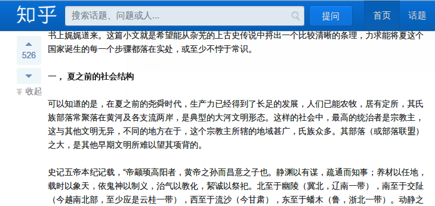

#Userscripts
Written by me or modified from others.

###[Freedly Evernote](/FreedlyEvernote.user.js)
Description: Let free account users share Feedly articles to Evernote.

###[Get High Resolution Android App Icon](/GetHighResolutionAndroidAppIcon.user.js)
**Description**: Click on the app icon on google play to download its high resolution copy.

###[Hacker News - Open Links in New Tab](/HackerNewsOpenLinksinNewTab.user.js)
**Description**: None

###[Instapaper BackHome Button](/InstapaperBackHomeButton.user.js)
**Description**: Add a backhome button at the top bar.

###[Pinboard Notes Filter](/PinboardNotesFilter.user.js)
**Description**: Add a filter for viewing your Pinboard notes.

###[Pinboard - Sort Visible Links(modified)](/PinboardSortVisibleLinksModified.user.js)
**Description**: A modified version of [Pinboard - Sort Visible Links](http://userscripts.org/scripts/show/114702), compatible with [Pinboard.in bookmarks with favicons](https://greasyfork.org/scripts/3514-pinboard-in-bookmarks-with-favicons).

###[GitHub Toc](/GitHubToc.user.js)
**Description**: Generate TOC(Table of Content) for Github readme and Github Wiki, Convert from [summerblue/github-toc](https://github.com/summerblue/github-toc).

###[Yun Pan WAP Redirect](/YunPanWAPRedirect.user.js)
**Description**: 重定向百度云盘的 WAP 页面到普通页面.

###[Zhihu Easy Collapse](/ZhiHuEasyCollapse.user.js)
**Description**: 快捷地收起知乎首页的长答案.

